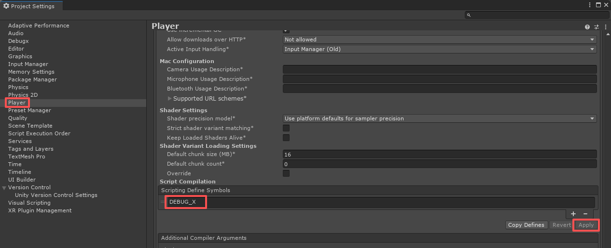
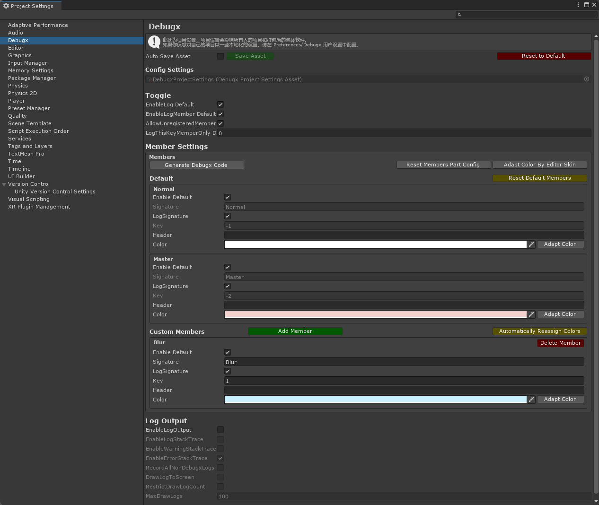
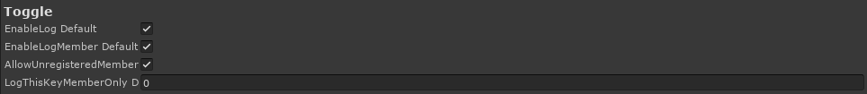
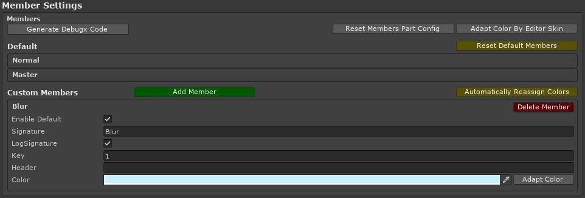
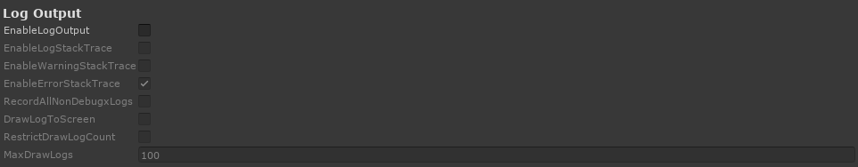
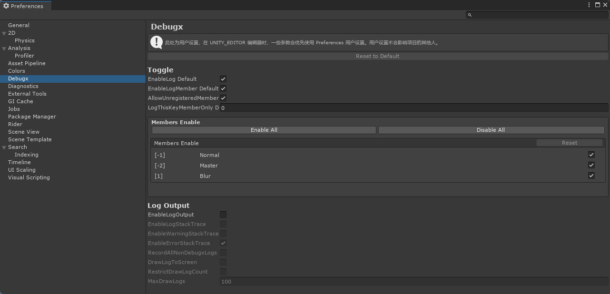
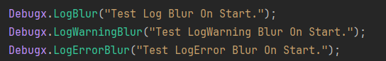
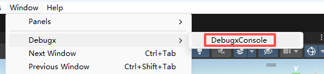
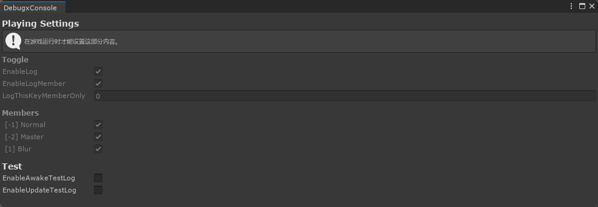

# Debugx User Manual
## Introduction
Github：https://github.com/BlurFeng/Debugx

Debugx is a debugging plugin specifically developed for the Unity engine.  
This plugin allows you to manage DebugLog by debugging members and output log files locally. Use the macro "DEBUG_X" to enable functionality.

In multi-developer collaborative projects, having all developers use UnityEngine.Debug.Log() makes logs difficult to manage and distinguish.  
When we test our own functionality, we don't want to be interfered by other people's log output.  
You only need to add the "DEBUG_X" macro to the project and perform simple configuration to start using Debugx functionality.  
Debugx provides configuration interfaces in both ProjectSettings and Preferences.  
Configurations in ProjectSettings affect the entire project, while user configurations in Preferences only affect your local environment and won't impact the project or other developers.  
DebugxConsole is used to manage print switches and other functions while the project is running.

## Plugin Installation and Configuration
Follow this manual to quickly install and configure the Debugx plugin.

### Adding Plugin to Project
Download the release package from the Releases page, and install the Debugx plugin to your project using the .unitypackage file.

Alternatively, install the plugin via UPM (Unity Package Manager).
```
https://github.com/BlurFeng/Debugx.git?path=DebugxDemo/Assets/Plugins/Debugx
```

### Adding Macro to Project
You must add the DEBUG_X macro to the project to enable log printing functionality.  
When releasing the project, you can remove the DEBUG_X macro to quickly disable Debugx functionality.


### Debugx Configuration
Hovering over fields will display tooltips, which can better help you familiarize yourself with Debugx.  
Since you can view detailed descriptions through tooltips, each option will not be introduced in detail here.  


#### ProjectSettings Project Settings
Open the Debugx project settings interface via Editor > ProjectSettings > Debugx.  
Project settings affect the entire project. When you need to add new debugging members, configure them here.


##### Toggle Switch Settings
Here are various switch settings. The main switch is displayed here, and debugging members can set switches individually in member information.  


##### MemberSettings Debug Member Settings
Member settings are used to configure debugging members. There are some preset members here that cannot be deleted and can only be edited to a limited extent.  
You can add exclusive member configurations in custom members, distinguishing by project users.  
You can set switches, signatures, colors, and other attributes. Most importantly is the member's Key, which will be used during log printing. Each member only needs to remember their own Key.  


##### LogOutput Log Output
The log output function starts recording when the project begins running and ends recording and outputs to local files when the project stops running.  
In the editor environment, log files are output to the Logs folder in the project root directory.  
In release versions, depending on different platforms, log files are stored in corresponding directories.  
On PC platforms, they are typically located in the C:\Users\UserName\AppData\LocalLow\DefaultCompany\ProjectName directory.


#### Preferences User Preference Settings
Open the Debugx user preference settings interface via Editor > Preferences > Debugx.  
User preference settings only affect your local project environment and won't affect other developers' projects or release versions.  
Mainly used for different developers to configure according to personal needs in their local environment. Each person typically only enables their own debugging member switches to avoid interference from other people's debug output.  


## Using Log Printing in Code
Now you can start using log printing functionality. Directly call static methods of the Debugx class to output logs.  


### Printing Methods
**Debugx.Log(key, message)**  
The Log series methods are the most commonly used methods, requiring you to pass in Key and print content. The Key is the identifier assigned to members in the debugging member configuration. Each member needs to remember and use their own Key.  
**Debugx.LogNom(message)**  
LogNom series methods are log printing methods for Normal ordinary members. General members should not use them, otherwise it's easy to cause confusion. All members can also use LogNom when printing common errors or warnings to ensure key information is always output.  
**Debugx.LogMst(message)**  
LogMst series methods are log printing methods for Master advanced members. Except for lead programmers, general personnel should not directly use this series of methods.  
**Debugx.LogAdm(message)**  
LogAdm series methods are exclusively for Debugx plugin developers! No one should use this method because logs printed through this method cannot be controlled through DebugxManager switches, but are still affected by the DEBUG_X macro.

## DebugxConsole Console
The Debugx console is mainly used to perform switch operations on Debugx functionality while the project is running. Open the window via Window > Debugx > DebugxConsole.  
For convenience, you can place it together with the Game tab.  


### PlayingSettings Runtime Settings
The content of project runtime settings is basically the same as in ProjectSetting, but allows adjustment during runtime.  

#### Test Testing
Testing function module. Provides some convenient testing function switches to confirm whether Debugx functionality is running normally.

## DebugxManager Manager
DebugxManager is automatically created when the game runs and typically requires no manual management. Its main responsibility is to handle LogOutput-related operations.  
DebugxManager is only automatically created when the DEBUG_X macro is added to the project.

