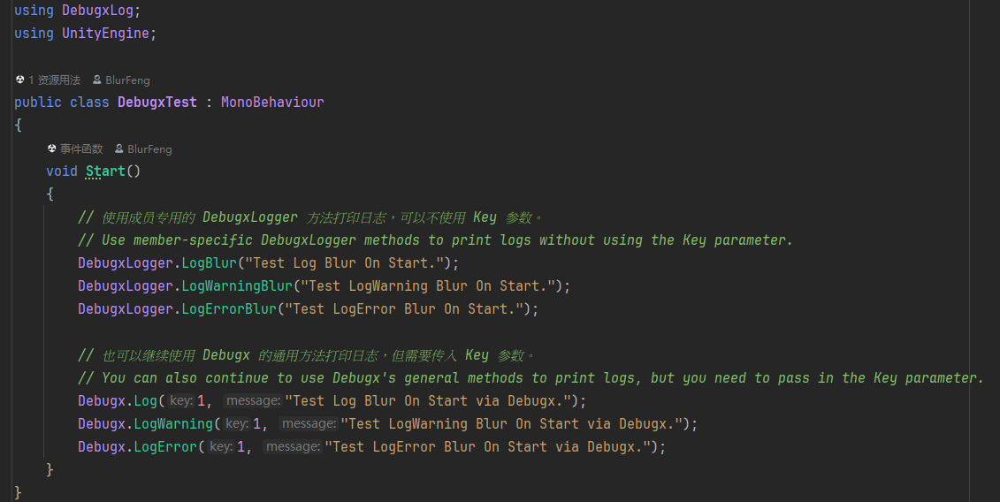

<p align="center">
  
  
  
  
</p>

<p align="center">
  🌍
  中文 |
  <a href="./README_EN.md">English</a> |
  <a href="./README_JA.md">日本語</a>
</p>

# Debugx
Unity 专用的调试功能扩展插件。通过配置可以按调试成员分类打印和管理 Debug Log，并将日志文件输出到本地。

你可以阅读 [用户手册](Documents/UserManual_cn.md) 来获得更多信息。

# 注意事项
> [!TIP]
> 1. 必须为项目添加宏 "DEBUG_X" 来启用 Debugx 功能。
> 2. 在更新插件后如果 DebugxLogger 类没有生成，使用菜单栏 Tools > Debugx > Regenerate DebugxLogger Class 来强制重新生成。
> 3. 插件在 2.3.0 之前的版本因为文件夹结构和 UPM 链接改变，无法正常更新，需要移除旧版本后重新安装。

## Unity 版本要求
Unity 2021.3 及以上版本。

## UPM 安装
使用 UPM（Unity Package Manager）方式安装插件。
```
https://github.com/BlurFeng/Debugx.git?path=Assets/Plugins/Debugx
```
1. 复制上面的链接
2. 打开 Unity 编辑器，进入 Window > Package Manager
3. 点击窗口左上角的 + 按钮，选择 "Add package from git URL..."
4. 粘贴链接，将插件安装到你的项目中

### 如何使用
首先，为项目添加宏 "DEBUG_X" 来启用 Debugx 功能。   
根据在 ProjectSettings > Debugx 中配置的调试成员，会自动生成对应的 DebugxLogger类和每个成员的 Log 方法。   
在代码中使用 DebugxLogger.LogMemberName(msg) 或 Debugx.Log(key,msg) 等方法即可轻松打印日志。   
