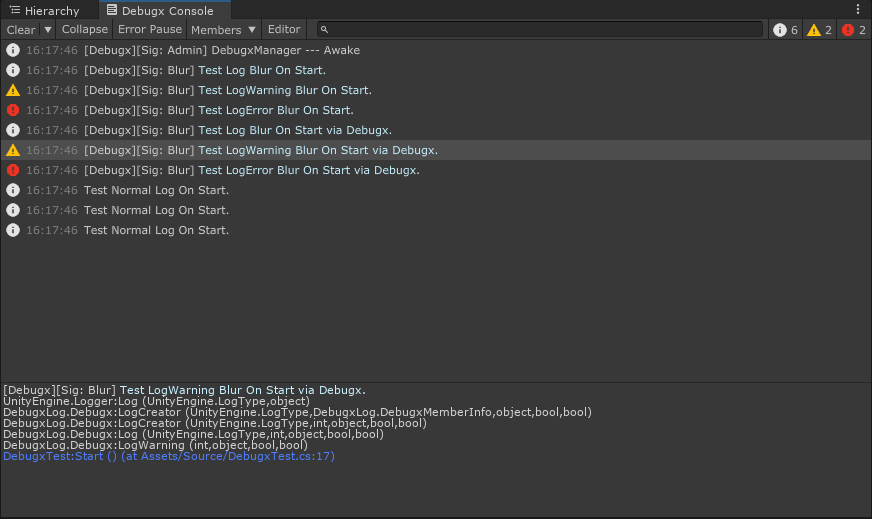
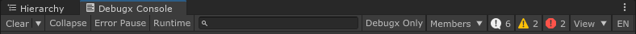
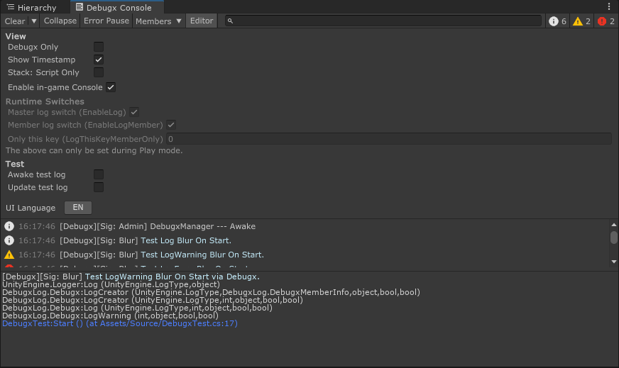
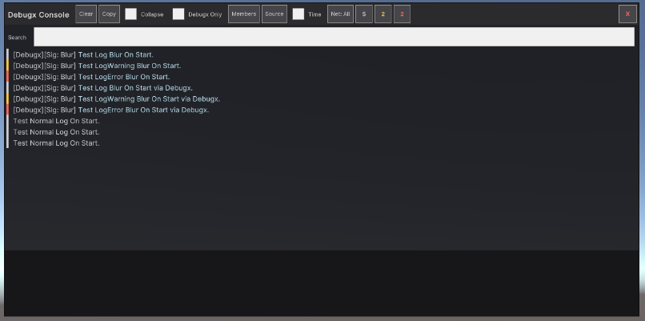

<p align="center">
  
  
  
  
</p>

<p align="center">
  🌍
  中文 |
  <a href="./README_EN.md">English</a> |
  <a href="./README_JA.md">日本語</a>
</p>

<p align="center">
  📥
  <a href="#使用-upm">安装</a> |
  <a href="#下载安装包">下载</a>
</p>

# Debugx - Unity 调试日志管理插件
Debugx 是一款面向 `Unity` 的调试日志扩展插件，开箱即用。它让你以**调试成员**（开发者 / 功能模块）为单位，对 `Debug.Log` 进行分类打印与管理，并可将日志输出到本地文件。  
在多人协作的项目中，所有人都用 `UnityEngine.Debug.Log()` 会让日志难以区分和管理；测试自己的功能时，也不希望被别人的日志干扰。Debugx 通过**成员分类 + 多级开关**，让每个人只关注自己的日志，互不干扰。  
所有打印方法都由宏 `DEBUG_X` 控制：添加宏即启用；发布时移除宏，即可让全部日志调用在**编译期**消失，做到 Release 零开销、零残留。  
借助自动生成的成员专属方法（如 `DebugxLogger.LogBlur("...")`）与封装的 `DebugxLog.dll`，你可以在无需记忆 Key 的同时，双击控制台日志直达业务调用处，而非跳进插件内部。  
此外，Debugx 内置了 **Debugx Console** 日志查看器（编辑器窗口 + 游戏内运行时叠层），让你以成员为单位过滤、查看日志，替代对 Unity 原生 Console 的依赖。


## 📜 目录
- [简介](#简介)
  - [项目特性](#项目特性)
- [💻 环境要求](#-环境要求)
- [🌱 快速开始](#-快速开始)
  - [1.安装插件](#1安装插件)
  - [2.添加 DEBUG_X 宏](#2添加-debug_x-宏)
  - [3.配置调试成员](#3配置调试成员)
  - [4.在代码中打印日志](#4在代码中打印日志)
- [⚙️ 配置指南](#-配置指南)
  - [配置界面与 Tooltip](#配置界面与-tooltip)
  - [ProjectSettings 项目设置](#projectsettings-项目设置)
  - [Preferences 用户偏好设置](#preferences-用户偏好设置)
- [✍️ 在代码中打印日志](#-在代码中打印日志)
  - [打印方法](#打印方法)
  - [预设成员与 Key](#预设成员与-key)
  - [运行时开关](#运行时开关)
- [🎛️ Debugx Console 日志控制台](#-debugx-console-日志控制台)
  - [编辑器窗口](#编辑器窗口)
  - [工具栏与过滤](#工具栏与过滤)
  - [列表与详情面板](#列表与详情面板)
  - [Editor 面板](#editor-面板)
  - [游戏内运行时叠层](#游戏内运行时叠层)
- [🧩 DebugxManager 管理器](#-debugxmanager-管理器)
- [⚠️ 注意事项](#-注意事项)

## 简介
使用 Debugx，你可以在多人协作的项目中，以调试成员为单位对日志进行分类打印和统一管理，避免所有人的 `Debug.Log` 混在一起难以辨认。  
Debugx 在 `ProjectSettings` 和 `Preferences` 中分别提供了配置界面：`ProjectSettings` 中的配置影响**整个项目**；`Preferences` 中的用户配置**仅影响你的本地环境**，不会波及项目和其他开发者。此外，`Debugx Console` 是内置的日志查看器（编辑器窗口 + 游戏内运行时叠层），用于查看、过滤日志，并在项目**运行时**管理打印开关。  
所有面向业务的打印方法均标记了 `[Conditional("DEBUG_X")]`，因此在没有 `DEBUG_X` 宏时，这些调用会在编译期被整体剔除，不会产生任何运行时开销。

### 项目特性
| 特性 | 描述 |
| --- | --- |
| 成员分类日志 | 以「调试成员」（开发者 / 模块）为单位分类打印，每个成员独立开关、签名、颜色，日志一目了然、互不干扰。 |
| 三级开关控制 | 项目级（`ProjectSettings`）、用户本地级（`Preferences`）、运行时级（`DebugxConsole` / 代码）三层开关，灵活组合。 |
| DEBUG_X 宏一键启停 | 所有打印方法均标记 `[Conditional("DEBUG_X")]`，移除宏即可让全部日志调用在编译期消失，Release 零开销、零残留。 |
| 自动生成成员方法 | 根据成员配置自动生成 `DebugxLogger.LogXxx()` 等专属方法，调用时无需记忆 Key，直接 `LogBlur("...")`。 |
| 精准堆栈定位 | 核心代码封装进 `DebugxLog.dll`，配合 `Logger` 命名与 `[HideInCallstack]`，双击控制台日志可直达业务调用处，而非插件内部。 |
| 本地日志输出 | 运行时自动记录日志到本地文件：编辑器输出到项目 `Logs/`，各平台输出到对应目录；可配置各级别堆栈跟踪、是否记录非 Debugx 日志等。 |
| 丰富的打印选项 | 支持时间戳、网络标记（Server / Client）、颜色、签名、Header；提供 `Log` / `LogWarning` / `LogError` 三档。 |
| 内置日志控制台 | `Debugx Console` 日志查看器，分**编辑器窗口**与**游戏内运行时叠层**两种形态：成员 / 类型 / 搜索多维过滤、折叠去重、时间戳、堆栈跳转、编译日志镜像，替代对原生 Console 的依赖。 |
| 编辑器友好 | 集成到 `ProjectSettings` 与 `Preferences`，字段带 Tooltip；自适应 Dark / Light 皮肤；界面按系统语言中英切换。 |

## 💻 环境要求
- `Unity 2022.3` 或更新的版本（更旧的版本未经测试）。
- 必须在项目中添加 `DEBUG_X` 宏以启用功能（见 [2.添加 DEBUG_X 宏](#2添加-debug_x-宏)）。
- 无任何第三方依赖。

## 🌱 快速开始
按你喜欢的方式安装插件，然后就可以按下面的步骤把 Debugx 添加到你的项目中。

### 1.安装插件
#### 使用 UPM
通过 UPM（Unity Package Manager）方式安装插件：
```
https://github.com/BlurFeng/Debugx.git?path=Assets/Plugins/Debugx
```
1. 复制上面的链接。
2. 打开 `Window -> Package Manager`。  
3. 点击窗口左上角的 `+` 号，选择 `Add package from git URL...`。  
4. 粘贴链接，点击 `Install` 将插件安装到你的项目中。  

#### 下载安装包
在 [Releases](https://github.com/blurfeng/debugx/releases) 页面下载最新的 `.unitypackage` 安装包，然后将其导入到你的项目中。  

### 2.添加 DEBUG_X 宏
必须在项目中添加宏 `DEBUG_X` 才能启用日志打印功能。在 `Project Settings -> Player -> Other Settings -> Scripting Define Symbols` 中添加 `DEBUG_X`。  
在项目发布时，移除宏 `DEBUG_X` 即可快速禁用 Debugx 的全部功能（相关调用会在编译期被剔除）。  


### 3.配置调试成员
通过 `Editor -> Project Settings -> Debugx` 打开项目设置界面，在**调试成员**中配置成员。  
每个成员拥有唯一的 `Key`、`Signature`（签名 / 名称）、颜色、开关等属性。**最重要的是成员的 `Key`**，它会在日志打印时用到，每个成员只需记住自己的 `Key` 即可。  
保存配置后，Debugx 会**自动生成**每个成员的专属打印方法（详见 [4.在代码中打印日志](#4在代码中打印日志)）。  


### 4.在代码中打印日志
现在你可以在代码中打印日志了。既可以使用**成员专属方法**（无需记忆 Key），也可以使用**通用方法**（需要传入 Key）：

```csharp
using DebugxLog;

// 成员专属方法（推荐，无需记忆 Key）。方法名由成员的 Signature 自动生成。
DebugxLogger.LogBlur("Hello from Blur.");
DebugxLogger.LogWarningBlur("Something looks off.");
DebugxLogger.LogErrorBlur("Something went wrong.");

// 通用方法（需要传入成员 Key）。
Debugx.Log(1, "Hello from key 1.");
Debugx.LogWarning(1, "Warning from key 1.");
Debugx.LogError(1, "Error from key 1.");
```

> [!TIP]
> `DebugxLogger` 类由插件根据成员配置**自动生成**。如果更新插件后 `DebugxLogger` 没有生成，或新增成员后没有对应方法，使用菜单 `Tools -> Debugx -> Regenerate DebugxLogger Class` 强制重新生成。

> [!TIP]
> 到这里 Debugx 已经可以正常工作了。若想深入了解各项配置与更多用法，请继续阅读下面的[配置指南](#-配置指南)与[在代码中打印日志](#-在代码中打印日志)。

## ⚙️ 配置指南
Debugx 的配置分为两处：`ProjectSettings`（影响整个项目）和 `Preferences`（仅影响你的本地环境）。以下主要讲解重要选项，更详细的说明可将鼠标悬停在各字段上查看 Tooltip。

### 配置界面与 Tooltip
将鼠标悬停在字段上时会显示 Tooltip，这能更好地帮助你熟悉 Debugx。由于可以通过 Tooltip 查看详细说明，这里不再逐项赘述。  


### ProjectSettings 项目设置
通过 `Editor -> Project Settings -> Debugx` 打开项目设置界面。项目设置会影响整个项目，当需要新增调试成员或调整全局默认行为时，在此处配置。  


#### 开关设置 Toggle
这里是各种全局开关的默认值。主开关在此显示，各调试成员也可以在成员信息中单独设置开关。主要包括：
- `enableLogDefault`：日志总开关默认值。关闭后不打印任何成员日志。
- `enableLogMemberDefault`：成员日志总开关默认值。
- `allowUnregisteredMember`：是否允许未注册（找不到对应 Key / 签名）的成员进行打印。
- `logThisKeyMemberOnlyDefault`：仅打印某个 Key 成员的日志，`0` 表示关闭该过滤。


#### 调试成员设置 Member
成员设置用于配置调试成员。这里有一些**预设成员**（见 [预设成员与 Key](#预设成员与-key)），它们不能被删除，只能有限地编辑。你可以在**自定义成员**中添加专属配置，按项目使用者区分。  
每个成员可设置的主要属性：
- `Key`：成员唯一标识，打印日志时使用。**每个成员记住自己的 Key 即可。**
- `Signature`：签名 / 名称，同时用于生成 `DebugxLogger` 的方法名（如 `Blur` -> `LogBlur`）。
- `Color`：日志颜色，便于在控制台中快速区分。
- `Header`：可选的日志前缀标签。
- `EnableDefault`：该成员日志的默认开关。


#### 日志输出 LogOutput
日志输出功能会在项目开始运行时启动记录，在项目停止运行时结束记录并输出到本地文件。主要选项：
- `logOutput`：是否输出日志到本地文件。
- `enableLogStackTrace` / `enableWarningStackTrace` / `enableErrorStackTrace`：分别控制 Log / Warning / Error 类型是否记录堆栈跟踪。
- `recordAllNonDebugxLogs`：是否记录所有非 Debugx 打印的日志。

日志文件的输出位置：
- **编辑器**：项目根目录的 `Logs` 文件夹。
- **发布版本**：按平台存储到对应目录。PC 平台通常在 `C:\Users\用户名\AppData\LocalLow\公司名\项目名` 目录下；移动平台位于对应的持久化数据目录。


### Preferences 用户偏好设置
通过 `Editor -> Preferences -> Debugx` 打开用户偏好设置界面。  
用户偏好设置**仅影响你的本地项目环境**，不会影响其他开发者，也不会影响发布版本。它主要用于不同开发者在本地按个人需求配置——每个人通常只启用自己的调试成员开关，以避免被他人的调试输出干扰。  


> [!NOTE]
> 在编辑器中运行时，实际生效的是 `Preferences` 的本地配置；在发布版本中，生效的是 `ProjectSettings` 中提交的项目配置。

## ✍️ 在代码中打印日志
直接调用 `DebugxLogger` 或 `Debugx` 类的静态方法即可输出日志。所有打印方法都受宏 `DEBUG_X` 控制。  


### 打印方法
**`DebugxLogger.LogXxx(message, showTime, showNetTag)`**  
调用对应调试成员的专属方法打印日志，`Xxx` 即成员的签名（Signature）。这是最推荐的方式，**无需记忆 Key**。同样提供 `LogWarningXxx` / `LogErrorXxx`。

**`Debugx.Log(key, message, showTime, showNetTag)`**  
最通用的方法，需要传入成员 `Key` 与打印内容。`Key` 是在成员配置中为成员分配的标识。同样提供 `Debugx.LogWarning` / `Debugx.LogError`；也支持用**签名**代替 Key：`Debugx.Log(signature, message, ...)`。

常用参数说明：
- `showTime`：是否在日志中显示时间戳。
- `showNetTag`：是否显示网络标记（Server / Client）。该功能依赖项目侧实现，需要先通过 `Debugx.SetServerCheck(Func<bool>)` 设置判断当前是否为服务器的方法后才会生效。

**`Debugx.LogAdm(message)`**  
`LogAdm` 系列为 **Debugx 插件开发者专用**，其他人不应使用。通过它打印的日志不受 `DebugxManager` 的成员开关控制，但仍受宏 `DEBUG_X` 影响。

### 预设成员与 Key
Debugx 内置了几个固定的预设成员，它们的 Key 已保留，请勿用于自定义成员：
- `Normal`（Key `-1`）：普通成员。
- `Master`（Key `-2`）：高级成员。
- `Admin`（Key `0`）：管理者成员，对应 `LogAdm` 通道。

自定义成员请使用**正整数** Key（`Key > 0` 才视为合法的可自定义 Key）。

### 运行时开关
运行时可以通过代码动态控制打印：
- `Debugx.SetMemberEnable(int key, bool enable)`：开关某个成员的日志（也可通过 `DebugxManager.Instance.SetMemberEnable(...)`）。
- `Debugx.enableLog` / `Debugx.enableLogMember`：日志总开关 / 成员日志总开关。
- `Debugx.logThisKeyMemberOnly`：设为某个 Key 后，仅打印该 Key 成员的日志（`0` 表示关闭该过滤）。

也可以在运行时通过 [Debugx Console](#-debugx-console-日志控制台) 的 Editor 面板 / 游戏内叠层以可视化方式调整这些开关。

## 🎛️ Debugx Console 日志控制台
`Debugx Console` 是一个**专用日志查看器**，以「调试成员」为核心对日志进行捕获、过滤、折叠与查看，替代对 Unity 原生 Console 的依赖。它有两种共享同一套捕获 / 过滤 / 折叠模型的形态：

- **编辑器窗口**——停靠在编辑器中使用，功能最完整。
- **游戏内运行时叠层**——在真机 / 打包版本运行时唤出，触屏友好。

> [!NOTE]
> 旧版本中 `DebugxConsole` 只是一个运行时开关控制面板。现在它升级为完整的日志查看器，原来的运行时开关与测试开关被收纳进窗口内可展开的 [Editor 面板](#editor-面板)；旧的「屏幕绘制日志」功能已移除，由[游戏内运行时叠层](#游戏内运行时叠层)取代。

### 编辑器窗口
通过 `Window -> Debugx -> DebugxConsole` 打开。为方便使用，可以把它和原生 `Console` / `Game` 标签页停靠在一起。窗口会捕获项目里所有的 Unity 日志：Debugx 成员日志按成员归类；非 Debugx 的普通日志（`Debug.Log`、引擎、第三方）统一归到 **Uncategorized**（未分类）。  

<!-- 截图占位：编辑器 Debugx Console 窗口全貌（工具栏 + 日志列表 + 下方详情面板） -->

### 工具栏与过滤
工具栏从左到右提供以下控件（窗口过窄时会按优先级自动隐藏次要控件）：
- **Clear**：立即清空日志。其右侧下拉可勾选**自动清空时机**——进入 Play 时 / 重编译时 / 构建时（均默认开启，对标原生 Console）。
- **Collapse**：折叠内容相同的重复日志，右侧以计数徽标显示条数。
- **Error Pause**：出现 Error / 异常时暂停播放（仅 Play 模式生效）。
- **Members**：按成员过滤，可多选；含 `全部`、各成员 `[key] 签名`，以及 `Admin` / `未注册` / `未分类` 等伪成员项。
- **Editor（编辑器）**：显示 / 隐藏下方可展开的 [Editor 面板](#editor-面板)——视图选项、启用游戏内 Console、运行时开关、测试开关、界面语言都收纳在其中。
- **搜索框**：按文本实时过滤（子串匹配，不区分大小写）。
- **Log / Warning / Error**：位于工具栏最右侧的三个带**计数**的类型开关，点击切换对应级别是否显示（超过 999 显示 `999+`）。


<!-- 截图占位：编辑器 Console 工具栏特写，标注各按钮 -->

### 列表与详情面板
- 每行显示：类型图标、时间戳（可选）、消息、折叠计数。
- **单击**选中并在下方详情面板查看完整消息与堆栈；**双击**（或回车）跳转到堆栈中第一个业务脚本帧对应的源码位置。
- 详情面板中，带源码信息的堆栈帧显示为**可点击**（悬停加粗），点击可用外部编辑器打开对应文件与行号。
- 支持**多选复制**：`Ctrl/Cmd + C` 复制选中项（含堆栈），`Ctrl/Cmd + Shift + C` 仅复制消息；右键菜单同样提供这两项。
- 列表**贴底时自动滚动**到最新；向上滚动会暂停自动滚动，滚回底部时恢复。
- 日志会**跨重编译 / 域重载持久保留**（编辑器重启后清空）；编译报错会自动镜像进来，连续编译失败时只保留最新一批（对标原生 Console）。

### Editor 面板
点击工具栏 **Editor（编辑器）** 展开。此面板把从工具栏收拢的视图选项与旧控制面板的运行时 / 测试开关集中到一处，便于在编辑器里边跑边调：
- **视图选项**（始终可用）：`仅Debugx`（只显示带 `[Debugx]` 标签的日志，隐藏 Uncategorized）、`显示时间戳`（每行时间列）、`堆栈：仅脚本`（详情堆栈仅显示业务脚本帧，隐藏引擎与插件内部帧）。
- **启用游戏内 Console**：是否在下次进入 Play 时自建[游戏内运行时叠层](#游戏内运行时叠层)（默认关闭，仅影响**编辑器 Play 模式**；真机需在代码中启用，详见该节）。
- **运行时开关**（仅 Play 模式可用）：`EnableLog`（日志总开关）、`EnableLogMember`（成员日志总开关）、`仅打印此 Key`（仅打印指定 Key 成员，`0` 为关闭）。这些会实时改写 `Debugx` 的运行时状态。（逐成员开关请在 `Preferences -> Debugx` 或游戏代码中设置。）
- **测试开关**：`Awake 测试打印` / `Update 测试打印`，用于快速确认 Debugx 是否正常工作。
- **界面语言**：中 / EN 切换。


<!-- 截图占位：编辑器 Console 展开 Editor 面板（视图选项 + 启用叠层开关 + 运行时开关 + 测试开关 + 语言） -->

### 游戏内运行时叠层
`DebugxRuntimeConsole` 是基于 UI Toolkit 的游戏内日志叠层，可在真机 / 打包版本中直接查看日志。它默认**关闭**，需满足以下条件才会自动创建：

1. 项目已添加 `DEBUG_X` 宏（叠层仅在有宏时才会编译进来）。
2. 已启用运行时叠层开关 `DebugxStaticData.RuntimeConsoleEnabled`（默认关闭）：
   - **编辑器 Play 模式**：在 `Debugx Console -> Editor` 面板勾选**启用游戏内 Console**（下次进入 Play 时生效）。
   - **真机 / 打包版本**：编辑器里的勾选**不会带进构建**，需在游戏代码中设置 `DebugxStaticData.RuntimeConsoleEnabled = true`（打包版 `PlayerPrefs` 初始为空，默认关闭）。

> [!NOTE]
> 叠层需要一个位于 `Resources` 下、名为 `Console` 的 UI Toolkit Panel Settings 资源。**插件已内置该资源**（`Resources/Console`），通常无需额外操作；若它缺失（被裁剪 / 删除），叠层不会启用并会在 Console 打印提示，此时在任意 `Resources` 目录新建一个命名为 `Console` 的 Panel Settings 即可。

满足条件后，叠层会在首个场景加载后自动创建（`DontDestroyOnLoad`），默认隐藏。**唤出 / 收起方式：**
- 桌面端：按**反引号键**（`` ` `` / `BackQuote`）。
- 触屏端：**三指同时点击**屏幕。
- 通用：屏幕角落的悬浮 **Debugx** 按钮；或在游戏代码中调用 `DebugxRuntimeConsole.SetVisible(true/false)` 绑定你自己的手势 / 热键。

> [!NOTE]
> 反引号键与三指手势依赖旧版 **Input Manager**。若项目仅启用了新 **Input System**，请改用悬浮按钮或 `SetVisible(...)` API 唤出。

叠层功能与编辑器版基本一致（触屏适配）：`Clear`、`Copy`、`Collapse`、`Debugx Only`、`Members` 成员过滤、`Time` 时间戳、`Net` 网络标记（All / Server / Client 循环）、`Log / Warning / Error` 类型过滤与计数，以及搜索（命中子串高亮）。列表支持**多选复制**（对齐编辑器版）：桌面端 `Ctrl+点击` 切换选中、`Shift+点击` 范围选中，`Ctrl/Cmd+C` 复制选中项（含堆栈，加 `Shift` 仅复制消息），点击空白处取消选中并回到「复制全部」；触屏仍为单击选中单行。工具栏控件已改用图标呈现，观感与编辑器版一致。此外 **Source** 弹层提供运行时开关（`EnableLog` / `EnableLogMember` / `Only Key` 及各成员开关），直接改写真实打印行为。选中某条日志可在下方查看消息与堆栈文本（运行时不支持源码跳转）。  

<!-- 截图占位：真机 / Play 模式下的游戏内运行时叠层（工具栏 + 日志列表 + 详情） -->

> [!TIP]
> 运行时叠层的环形缓冲默认容量为 1000 条（对移动端友好）。

## 🧩 DebugxManager 管理器
`DebugxManager` 在游戏运行时**自动创建**，通常无需手动管理。它的主要职责是处理 `LogOutput` 相关操作（启动 / 结束记录、设置输出路径等）。  
只有在项目中添加了 `DEBUG_X` 宏时，`DebugxManager` 才会通过 `[RuntimeInitializeOnLoadMethod]` 在运行时自动创建。其 `Create()` 方法为 `virtual`，可供项目派生扩展。

## ⚠️ 注意事项
> [!TIP]
> 1. 必须为项目添加宏 `DEBUG_X` 来启用 Debugx 功能。
> 2. 在更新插件后如果 `DebugxLogger` 类没有生成，使用菜单 `Tools -> Debugx -> Regenerate DebugxLogger Class` 强制重新生成。
> 3. 插件在 `2.3.0` 之前的版本因为文件夹结构和 UPM 链接改变，无法正常更新，需要移除旧版本后重新安装。
