<p align="center">
  
  
  
  
</p>

<p align="center">
  🌍
  <a href="./README.md">中文</a> |
  English |
  <a href="./README_JA.md">日本語</a>
</p>

<p align="center">
  📥
  <a href="#using-upm">Install</a> |
  <a href="#download-the-package">Download</a>
</p>

# Debugx - Unity Debug Log Management Plugin
Debugx is a debug-logging extension plugin for `Unity`, ready to use out of the box. It lets you categorize and manage `Debug.Log` output by **debug member** (a developer or feature module), and write logs to local files.  
In multi-developer projects, having everyone call `UnityEngine.Debug.Log()` makes logs hard to tell apart and manage; and when testing your own feature, you don't want to be disturbed by other people's logs. Debugx uses **member categorization + multi-level switches** so everyone focuses only on their own logs, without interfering with each other.  
All print methods are controlled by the `DEBUG_X` macro: add the macro to enable them; remove it when shipping and every log call is stripped at **compile time**, achieving zero runtime overhead and zero residue in Release builds.  
With auto-generated member-specific methods (e.g. `DebugxLogger.LogBlur("...")`) and the wrapped `DebugxLog.dll`, you can print without memorizing Keys, while double-clicking a console log jumps straight to your business call site instead of into the plugin internals.

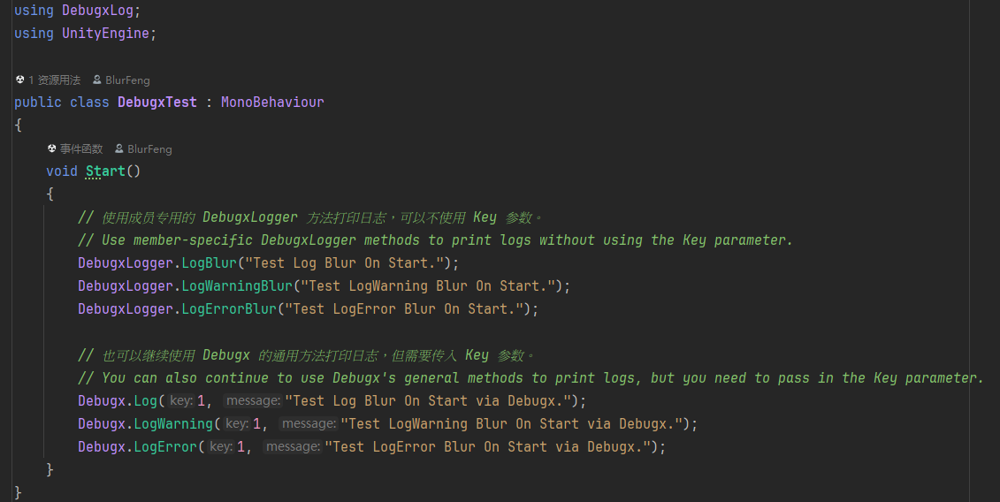

## 📜 Table of Contents
- [Introduction](#introduction)
  - [Features](#features)
- [💻 Requirements](#-requirements)
- [🌱 Quick Start](#-quick-start)
  - [1.Install the Plugin](#1install-the-plugin)
  - [2.Add the DEBUG_X Macro](#2add-the-debug_x-macro)
  - [3.Configure Debug Members](#3configure-debug-members)
  - [4.Print Logs in Code](#4print-logs-in-code)
- [⚙️ Configuration Guide](#-configuration-guide)
  - [Configuration UI & Tooltips](#configuration-ui--tooltips)
  - [ProjectSettings](#projectsettings)
  - [Preferences](#preferences)
- [✍️ Printing Logs in Code](#-printing-logs-in-code)
  - [Print Methods](#print-methods)
  - [Preset Members & Keys](#preset-members--keys)
  - [Runtime Switches](#runtime-switches)
- [🎛️ DebugxConsole](#-debugxconsole)
  - [PlayingSettings](#playingsettings)
  - [Test](#test)
- [🧩 DebugxManager](#-debugxmanager)
- [⚠️ Notes](#-notes)

## Introduction
With Debugx, in multi-developer projects you can categorize and centrally manage logs per debug member, avoiding everyone's `Debug.Log` getting mixed together and hard to distinguish.  
Debugx provides configuration UIs in both `ProjectSettings` and `Preferences`: settings in `ProjectSettings` affect the **entire project**; user settings in `Preferences` affect **only your local environment** and never impact the project or other developers. In addition, `DebugxConsole` manages print switches and other functions at **runtime**.  
All business-facing print methods are marked with `[Conditional("DEBUG_X")]`, so without the `DEBUG_X` macro these calls are stripped entirely at compile time and incur no runtime overhead.

### Features
| Feature | Description |
| --- | --- |
| Member-based logging | Categorize prints per "debug member" (developer / module); each member has its own switch, signature and color — logs are clear and non-interfering. |
| Three-level switches | Project level (`ProjectSettings`), local user level (`Preferences`) and runtime level (`DebugxConsole` / code) — combine them freely. |
| One-macro on/off (DEBUG_X) | All print methods are marked `[Conditional("DEBUG_X")]`; remove the macro and every log call vanishes at compile time — zero overhead, zero residue in Release. |
| Auto-generated member methods | Member-specific methods such as `DebugxLogger.LogXxx()` are generated from your member config — call `LogBlur("...")` without memorizing Keys. |
| Precise stack navigation | Core code is wrapped in `DebugxLog.dll`; combined with the `Logger` naming and `[HideInCallstack]`, double-clicking a console log jumps straight to the business call site instead of the plugin internals. |
| Local log output | Logs are recorded to local files at runtime: the editor writes to the project `Logs/`, and each platform writes to its own directory; stack traces, on-screen drawing, etc. are configurable. |
| Rich print options | Supports timestamp, network tag (Server / Client), color, signature and Header; provides `Log` / `LogWarning` / `LogError`. |
| Editor-friendly | Integrated into `ProjectSettings` and `Preferences` with Tooltips on fields; adapts to Dark / Light skins; the UI switches between Chinese and English by system language. |

## 💻 Requirements
- `Unity 2021.3` or newer (older versions are untested).
- You must add the `DEBUG_X` macro to your project to enable the features (see [2.Add the DEBUG_X Macro](#2add-the-debug_x-macro)).
- No third-party dependencies.

## 🌱 Quick Start
Install the plugin whichever way you prefer, then follow the steps below to add Debugx to your project.

### 1.Install the Plugin
#### Using UPM
Install via UPM (Unity Package Manager):
```
https://github.com/BlurFeng/Debugx.git?path=Assets/Plugins/Debugx
```
1. Copy the link above.
2. Open `Window -> Package Manager`.
3. Click the `+` button in the top-left corner and select `Add package from git URL...`.
4. Paste the link and click `Install` to add the plugin to your project.

#### Download the Package
Download the latest `.unitypackage` from the [Releases](https://github.com/blurfeng/debugx/releases) page, then import it into your project.

### 2.Add the DEBUG_X Macro
You must add the `DEBUG_X` macro to your project to enable log printing. Add `DEBUG_X` under `Project Settings -> Player -> Other Settings -> Scripting Define Symbols`.  
When shipping, remove the `DEBUG_X` macro to quickly disable all Debugx features (the related calls are stripped at compile time).  
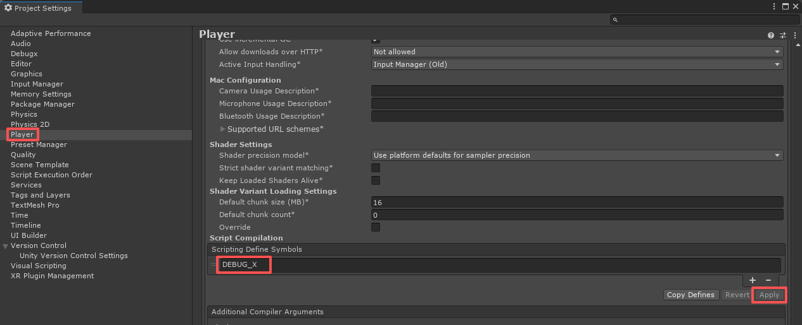

### 3.Configure Debug Members
Open `Editor -> Project Settings -> Debugx` and configure members under **Debug Members**.  
Each member has a unique `Key`, `Signature` (name), color, switch and other properties. **The most important one is the member's `Key`**, which is used when printing logs — each member only needs to remember their own `Key`.  
After saving, Debugx **auto-generates** a dedicated print method for each member (see [4.Print Logs in Code](#4print-logs-in-code)).  
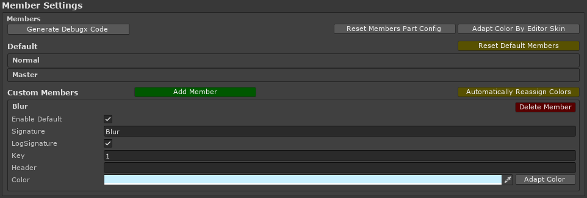

### 4.Print Logs in Code
Now you can print logs in code. You can use **member-specific methods** (no need to memorize Keys) or the **generic methods** (which take a Key):

```csharp
using DebugxLog;

// Member-specific methods (recommended, no need to memorize Keys). Method names are generated from the member's Signature.
DebugxLogger.LogBlur("Hello from Blur.");
DebugxLogger.LogWarningBlur("Something looks off.");
DebugxLogger.LogErrorBlur("Something went wrong.");

// Generic methods (require the member Key).
Debugx.Log(1, "Hello from key 1.");
Debugx.LogWarning(1, "Warning from key 1.");
Debugx.LogError(1, "Error from key 1.");
```

> [!TIP]
> The `DebugxLogger` class is **auto-generated** from your member config. If `DebugxLogger` isn't generated after updating the plugin, or a newly added member has no method, use the menu `Tools -> Debugx -> Regenerate DebugxLogger Class` to force regeneration.

> [!TIP]
> At this point Debugx already works. To learn more about the configuration and usage, continue reading the [Configuration Guide](#-configuration-guide) and [Printing Logs in Code](#-printing-logs-in-code) below.

## ⚙️ Configuration Guide
Debugx configuration lives in two places: `ProjectSettings` (affects the entire project) and `Preferences` (affects only your local environment). The key options are covered below; hover over any field to see its Tooltip for more details.

### Configuration UI & Tooltips
Hovering over a field shows a Tooltip, which helps you get familiar with Debugx. Since detailed descriptions are available via Tooltips, they aren't repeated one by one here.  
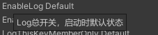

### ProjectSettings
Open `Editor -> Project Settings -> Debugx`. Project settings affect the entire project — configure here when you need to add debug members or adjust global default behavior.  
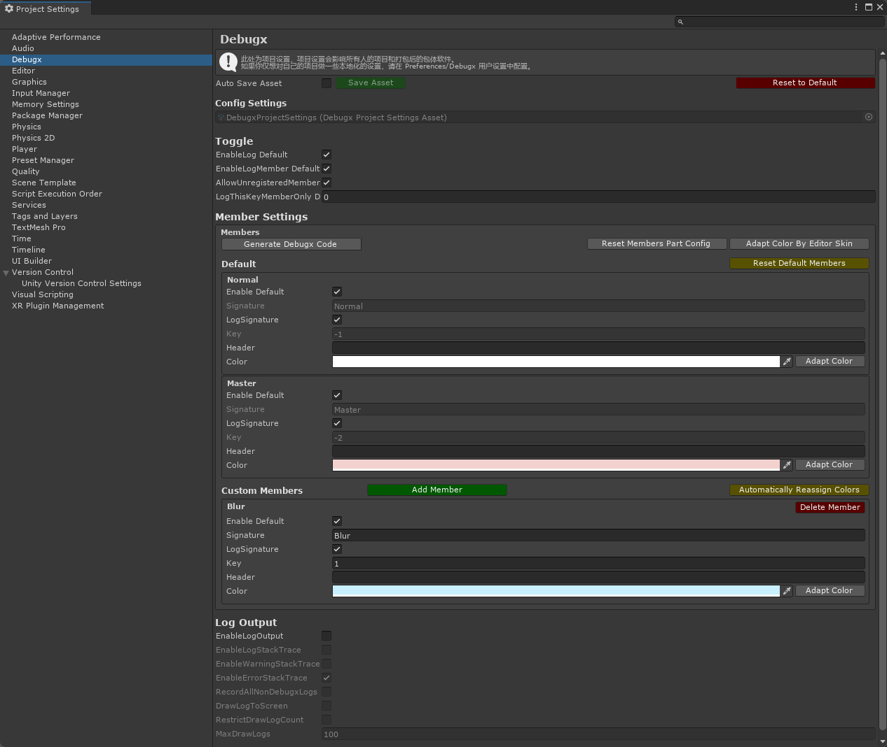

#### Toggle Settings
Default values for the various global switches. The master switches are shown here, and each debug member can also set its own switch in the member info. Main options:
- `enableLogDefault`: default value of the master log switch. When off, no member logs are printed.
- `enableLogMemberDefault`: default value of the member-log master switch.
- `allowUnregisteredMember`: whether members that aren't registered (no matching Key / signature) may print.
- `logThisKeyMemberOnlyDefault`: print logs only for a specific Key member; `0` disables this filter.

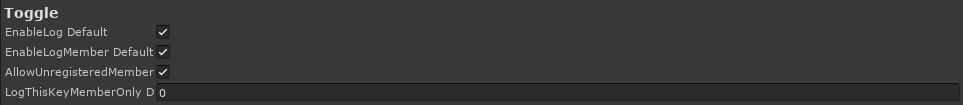

#### Member Settings
Member settings configure the debug members. There are some **preset members** (see [Preset Members & Keys](#preset-members--keys)) that cannot be deleted and can only be edited in a limited way. You can add your own configs under **custom members**, distinguished per project user.  
Main properties per member:
- `Key`: the member's unique identifier, used when printing. **Each member only needs to remember their own Key.**
- `Signature`: the name, also used to generate the `DebugxLogger` method name (e.g. `Blur` -> `LogBlur`).
- `Color`: the log color, to quickly tell members apart in the console.
- `Header`: an optional log prefix label.
- `EnableDefault`: the default switch for this member's logs.


#### LogOutput
Log output starts recording when the project starts running, and stops and writes to a local file when the project stops. Main options:
- `logOutput`: whether to output logs to a local file.
- `enableLogStackTrace` / `enableWarningStackTrace` / `enableErrorStackTrace`: whether to record stack traces for the Log / Warning / Error types respectively.
- `recordAllNonDebugxLogs`: whether to record all logs not printed by Debugx.
- `drawLogToScreen` / `restrictDrawLogCount` / `maxDrawLogs`: whether to draw logs on screen, whether to limit the count, and the max count.

Where log files are written:
- **Editor**: the `Logs` folder in the project root.
- **Release builds**: stored in a platform-specific directory. On PC this is usually `C:\Users\UserName\AppData\LocalLow\CompanyName\ProductName`; on mobile it's the corresponding persistent data directory.

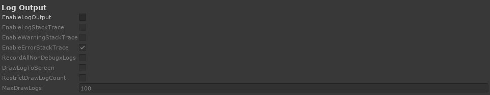

### Preferences
Open `Editor -> Preferences -> Debugx`.  
User preferences affect **only your local project environment** — they never affect other developers or Release builds. They're mainly for different developers to configure locally to taste; typically each person only enables their own debug member switches to avoid being disturbed by others' output.  
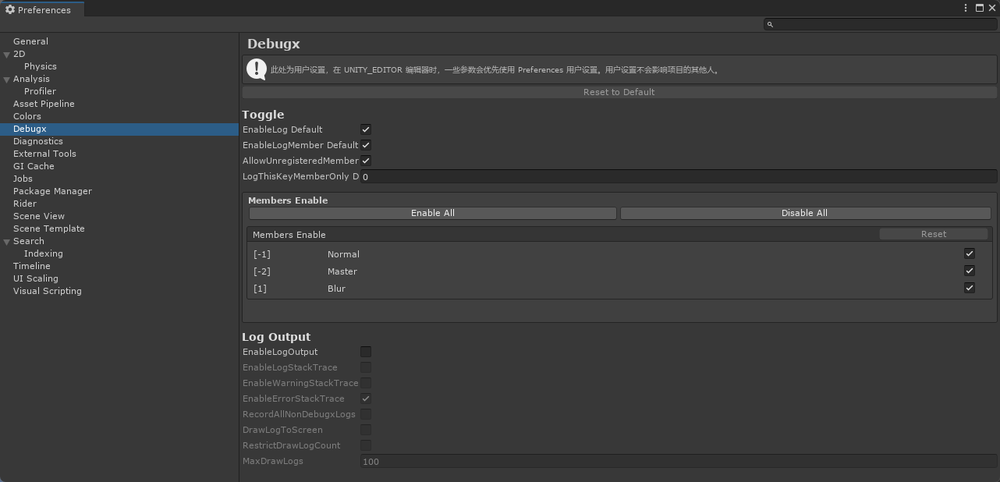

> [!NOTE]
> When running in the editor, the effective config is your local `Preferences`; in Release builds, the effective config is the project config committed in `ProjectSettings`.

## ✍️ Printing Logs in Code
Call the static methods of `DebugxLogger` or `Debugx` to output logs. All print methods are controlled by the `DEBUG_X` macro.  
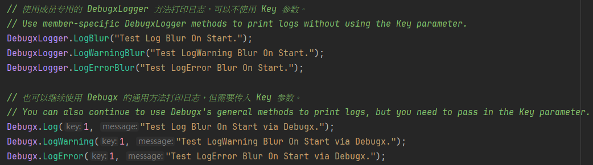

### Print Methods
**`DebugxLogger.LogXxx(message, showTime, showNetTag)`**  
Calls the dedicated method of the corresponding debug member, where `Xxx` is the member's Signature. This is the recommended way — **no need to memorize Keys**. `LogWarningXxx` / `LogErrorXxx` are also provided.

**`Debugx.Log(key, message, showTime, showNetTag)`**  
The most generic method; takes the member `Key` and the content to print. The `Key` is the identifier assigned to the member in the member config. `Debugx.LogWarning` / `Debugx.LogError` are also provided; you can also use the **signature** instead of the Key: `Debugx.Log(signature, message, ...)`.

Common parameters:
- `showTime`: whether to show a timestamp in the log.
- `showNetTag`: whether to show the network tag (Server / Client). This depends on the project side and only takes effect after you set a "is this a server" check via `Debugx.SetServerCheck(Func<bool>)`.

**`Debugx.LogAdm(message)`**  
The `LogAdm` family is **for Debugx plugin developers only** and should not be used by others. Logs printed through it are not controlled by `DebugxManager`'s member switches, but are still affected by the `DEBUG_X` macro.

### Preset Members & Keys
Debugx ships with a few fixed preset members whose Keys are reserved — do not use them for custom members:
- `Normal` (Key `-1`): normal member.
- `Master` (Key `-2`): master member.
- `Admin` (Key `0`): administrator member, corresponding to the `LogAdm` channel.

Use **positive integer** Keys for custom members (only `Key > 0` is treated as a valid custom Key).

### Runtime Switches
You can control printing dynamically from code at runtime:
- `Debugx.SetMemberEnable(int key, bool enable)`: toggle a member's logs (also available via `DebugxManager.Instance.SetMemberEnable(...)`).
- `Debugx.enableLog` / `Debugx.enableLogMember`: the master log switch / member-log master switch.
- `Debugx.logThisKeyMemberOnly`: when set to a Key, only that Key member's logs are printed (`0` disables this filter).

You can also adjust these switches visually at runtime via the [DebugxConsole](#-debugxconsole).

## 🎛️ DebugxConsole
`DebugxConsole` is mainly used to toggle Debugx features at **runtime**. Open it via `Window -> Debugx -> DebugxConsole`. For convenience you can dock it next to the `Game` tab.  
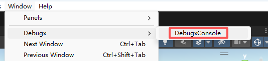

### PlayingSettings
The runtime settings are basically the same as in `ProjectSettings`, but can be adjusted live while the project is running — handy for tuning on the fly.  
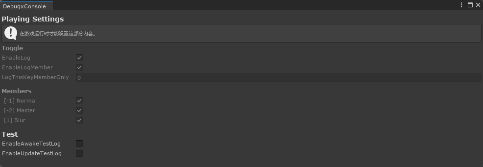

### Test
A testing module. It provides some handy toggles to verify that Debugx is working (e.g. the `EnableAwakeTestLog` / `EnableUpdateTestLog` test-print switches).

## 🧩 DebugxManager
`DebugxManager` is **created automatically** at runtime and usually needs no manual management. Its main job is to handle `LogOutput` operations (start/stop recording, set the output path, draw on screen, etc.).  
`DebugxManager` is auto-created at runtime via `[RuntimeInitializeOnLoadMethod]` only when the `DEBUG_X` macro is present. Its `Create()` method is `virtual` so project subclasses can extend it.

## ⚠️ Notes
> [!TIP]
> 1. You must add the `DEBUG_X` macro to your project to enable Debugx.
> 2. If the `DebugxLogger` class isn't generated after updating the plugin, use the menu `Tools -> Debugx -> Regenerate DebugxLogger Class` to force regeneration.
> 3. Versions before `2.3.0` cannot be updated normally due to changes in folder structure and UPM links — remove the old version and reinstall.
